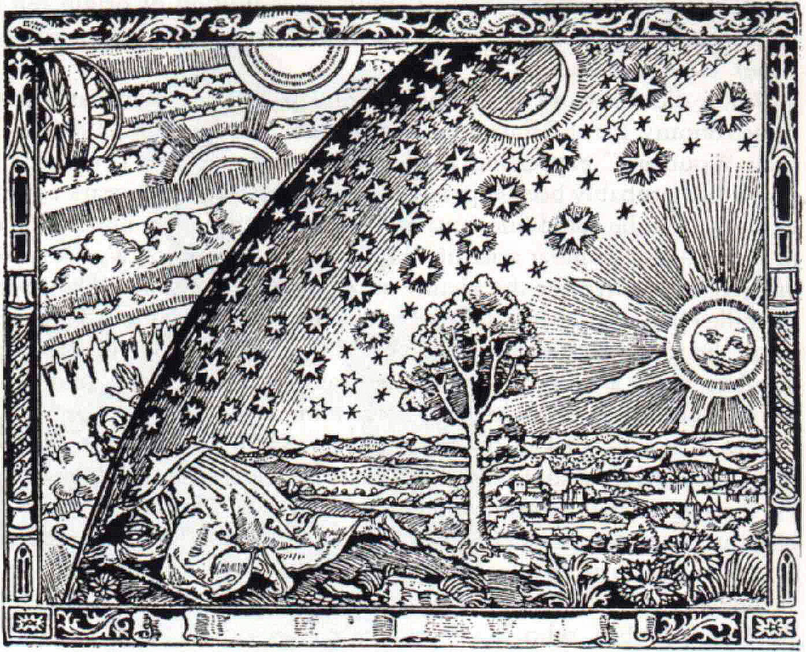
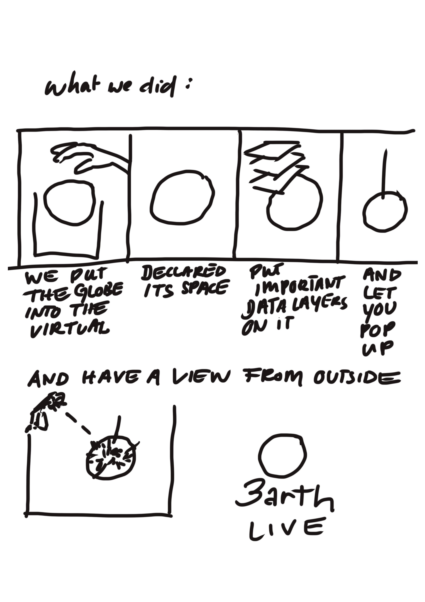

# 1st Virtual Realtime Globe
Repository for 1st Virtual Realtime Globe
- a multitool for climate / earth science geospatial data and its potential for extended augmented XR experience and state / exchange potential.

## Contents

- [Short description](#short-description)
  - [What's the problem?](#whats-the-problem)
  - [How can technology help?](#how-can-technology-help)
  - [The idea](#the-idea)

- [Long description](#long-description)
- [The architecture](#the-architecture)
- [Demo video](#demo-video)
- [Project roadmap](#project-roadmap)
- [Getting started](#getting-started)
- [Live demo](#live-demo)
- [Further info](#further-info)
  - [Built with](#built-with)
  - [Contributing](#contributing)
  - [Versioning](#versioning)
  - [Authors](#authors)
  - [License](#license)
  - [Acknowledgments](#acknowledgments)

## Short description

1VRG is the digital and virtual representation of planet earth in digital / virtual space - the virtual globe in realtime, with its all its streams and parameters, brought together on the body of a round shape (that is capable of showing  the interdependencies and further capacities.

### What's the problem?

<condition state>
Massive eruptions in global system on many scales, we are on the break to climate catastrophies and the potential end.
We need to taket he paradigmatic step and leave flatlands, see interconnectedness and making sense of the interlinkage.  nextLevel: "The Age of Within"
We are in "#LevelCrisis".

We have to bring it all together to one BIG PICTURE

### How can technology help?

Technology can help to bring it all together to one BIG augmented PICTURE.

####DATA
- Combined data on that scope!
- Analytics, derives, relations,
- effective parameter
- Inscription, Enclosure, Topology, Ontology

####Augmented space

## TO HONESTLY TALK TO YOU:
  THIS COULD MAKE A DIFFERENCE.
  IF WE HAVE A TRUE LOCATED VIRTUAL TWIN WITH ALL THE INFORMATION ACCESSIBLE AMD OBVIOS TO ANYONE, IF WE COMBINE THE STATEW SPACES, WE CAN AUGMENT

### The idea

### VISION

*image_caption_Flammarion*

### METHOD

|  |
|:--:|
| *Scape* |

### STORY

#### Project Idea

The idea is: an outermost technology setup and claim for next-augmented scape, digital/virtual space:
1st Virtual Realtime Globe, that contains many layers.

Its development is setup in different levels and application spectres.

There are also other applications for specific layers and als a roadmap to be deepeer developed into XRanddeep information and direction

#### STEP 1: v.1.0 Carbon Globe [proof of concept] - "The Grandmother of Geospatial Webmapping"

The project idea was developed in 2017.

This basic tool consists of some basic process steps, that shall be refined over time.

"Carbon Globe" was composed as one basic first layer, created to be implemented as a Kunst-am-Bau work at DBFZ, Leipzig | GER. The installation will be finished in late 2021.

 - [*GEOSPATIALIZER*](./v.1.0/PYTHON-Geospatilizer/emissions-topojson-master_v21-07)
python script, that does the basic data inscriving work
and merges emission data (from excel tables) with geospatial, parameter enriched data

 - [*WEBMAPPER*](./v.1.0/JAVASCRIPT-cesium-WebGL_Renderer/co2visu-master_v21-07/co2globe)
lets the geospatial referenced dataset figure being - automatically integrated into the parameter taxonomy and being - mapped onto a virtual realtime globe
with the  framework cesium.js

[See v.1.0](./v.1.0/)

## Long description

#1VRG

We urgently need a holistic tool for climate issues. Create awareness for condition state of earth, interlinkage, embedment and action.

Within the scope of “GLOBAL CHALLENGE” we urgently need:
- a fresh body of imagination (augmented/virtual 3D spacetime instead of flat, linear, separate)
- change in perspective / point of view (POV) of individuals (towards holistic interlinked entity thinking and awareness)
- look at (and understand deeply) the dramatic figures of (climate) condition
- see the interlinkages and co-dependencies within system
- develop a collective drive “ONE EARTH” - survival dynamics
- forms of interlinked scape and actions beyond old flat/static platform

There is an exponential growing body of (climate change /earth science / condition specific) data, there is so much areas/ info, but it is all separated. There are impressive visualisations, merges, that make information available, give insight, but flat and distinct, without the framework and weight of timespace, without direct binding to planet Earth or own experienced carbon world - rational and not felt deep within), not daring to overlay and combine deep, to one “Big Picture” of what we know..
without linking to one upper folder,
as ‘one, unfortunately very dramatic, combined knowledge map’,
combining it all (and projecting it right),
that,
and the potential of located representation and presence in virtual/digital/augmented space (and its dimensional advanced perspectives and) ‘higher-ordered’ potentials.

We need one place/spacetime-framework, where we can combine and superpose data and provide deeper insights on condition state, grant access in a very new form of getting the knowledge into our system: experience and see:

Virtual space is the next scape and the additional layer augmenting analog reality and experience.
Digital space, virtual territory is still non-claimed, un-bound, earth representation/center unresolved.
Different players like Google Earth, Esri (and other web map technologies, etc.) follow different trajectories and goals (- they want to provide technology, but they are not free to proclaim new what is missing:

There is yet no specific virtual globe, that focuses on our global condition state regarding climate catastrophe.
No entity in web has yet created this and proclaims to be THE virtual representation of our planet as a realtime application upon which a lot can further be developed.

It is like a Copernican Revolution within the digital: from flat to spherical/3D/augmented / meta-level’d gating / deeper spheres…

[1VRG] is the 1st Virtual Realtime Globe, that wants to fill this gap,
setting up rihgt at the center of virtual coordinate system, mapping global,
bringing together relevant climate earth condition focused data, combines it with its spatial, temporal and effective parameters and maps advanced insight Earth data: live, historic, future scenarios. renderable, immersive, true, deep. -
onto a unique digital 3D earth representation.

1VRG `s claim:
The big picture of planet Earth entity and its condition states - in realtime - interactive - immersive - real.

DEEPER / NEXT
From freeing data from excel cells to most advanced data analytics and mapping for seeing the scope in its deep valleys of experienced co:local states of /. and trajectories- :/beyond / <multi-gated> as <next> POV.

METHOD:
1) Let’s take the marble. virtual and 3D. Let’s call it “1VRG”.
2) Put those data layers on it,
3) make it realtime,
4) intelligent (deeper data analytics, relations, calculations, insights) and
5) project, visualise, map - shocking insights and connections
6) augment, immerse (grant access to drive-throughs and critical points) experiential in XR
7) make it interactive (gamification) - *hand in the game* - via global condition number : individual footprint number [calculations and feedback]: —> EQUILLIBRIUM <—
8) have a [1VRG] with all upcoming potential
as the 1st Virtual Realtime Earth representation - the place to be, see and act - on a global scale - [connections, effects, feedbacks…]
9) find assets and exchange forms for “sustainable global”

I think we truly shall -with united forces - make this happen right now:
1st Virtual Realtime Globe.

[More detail is available here](./docs/DESCRIPTION.md)

[More details for Tech Players available here](./docs/tech-player-info.md)

## The architecture

### CLAIM/NARRATION:

(1) "Let’s call it “1VRG”."-  with focus, function and abilities

Available Domains
- http://changewatch.net - View changes over time
- http://intelligentenvironment.net - View on the full sys

### Technology
#### BASIC:
##### (1) "Let’s take the marble. virtual and 3D."
Virtual Globe (WebGL webVR, XR frameworks and effective namespaces)

##### (2) "Put those data layers on it"
- Get (basic) data - (from easy to complex and advanced)
- prepare & enrich them - (from easy to complex and advanced)
  - geospatial component: declaration, namespaces
  - source metadata component: declaration, namespaces
  - data parameter physical component
  - normalisations
  - mapping parameter
  - dataframe combined (encapsulation and format)
  - naming convention for automation
  - merger

  - read dataset
  - create menu basing on naming convention (data sets)  --- FUNCT ERR
  - selected parameter -> heights, colors, info   --- FUNCT ERR

---> NEEDS:

#### ADVANCED:

##### (3) make it realtime,
##### (4) intelligent (deeper data analytics, relations, calculations, insights) and

##### (5) project, visualise, map - shocking insights and connections
#####( 6) augment, immerse (grant access to drive-throughs and critical points) experiential in XR

##### (7) make it interactive (gamification) - *hand in the game* - via global condition number : individual footprint number [calculations and feedback]: —> EQUILLIBRIUM <—

##### (8) have a [1VRG] with all upcoming potential as the 1st Virtual Realtime Earth representation - the place to be, see and act - on a global scale - [connections, effects, feedbacks…]

##### (9) find assets and exchange forms for “sustainable global”

## Project roadmap

A document or image that shows how mature your solution is today and how you would like to improve it in the future. This can include information on the business model, future funding needs, and a sustainability plan.

### TECHNOLOGICAL ADVANCES
#### Basic technology
#### IBM technology

### ROADMAP

See below for our proposed schedule on next steps after Call for Code 2021 submission.

#### STEP 1: v.1.0 Carbon Globe [proof of concept] - "The Grandmother of Geospatial Webmapping"

#### STEP 2: v.1.1 Globe for "GLOBAL CHALLENGE" with IBM and more ..  [reflect what is possible]

#### STEP 3: v.1.1 Carbon Globe [optimized]
- clean
- clean
- ..

#### Versions
##### v.0.1 Static Data Implementation - BASIC DATA SETS (geospatial  + emission data)

##### v.1.0 Dynamic Realtime Data Implementation - Towards Complete DATA SETS (geospatial + /scopes(combined climate / earth science / glocal datasets))

##### v.2.0
DynamicRealtimeData

##### v.3.0 - XR Potential
DynamicRealtimeData

#### IMPLEMENTATION STAGE

#### with Fraunhofer FOKUS + narimo systems

The project currently does the following things.

- Automatically combines .csv/excel data with metadata according to defined configurations, and embeds the data with geospatial data component
- implements topology for further automated processing
- exports data as .topojson Files
- Feature 3

It's in a free tier IBM Cloud Kubernetes cluster. In the future we plan to run on Red Hat OpenShift, for example.

#### TODO / OUTLOOK

#### with IBM & potential investor

## Demo video

## Getting started

instructions to run project on  local machine for development and testing purposes and how to deploy the project in production.

- [geospatializer](./v.1.0/)
- [viz](./v.1.0/)

### Prerequisite

### Run the scripts
Step 1.
Step 2.

## Live demo

You can find a running system to test at .

## Further info
### Built with

-
### Contributing

Please read [CONTRIBUTING.md](CONTRIBUTING.md) for details on our code of conduct, and the process for submitting pull requests to us.

### Versioning

### Authors

#### ID
##### Perspective: [#Self-Historizism(OUTLOOK:<method>[TEST]:
  [Lineature / Lining ("/right in time").expandedFramework()
 data ($TIME // $SPACE ///[potential] /EXP potential:
  [:INTER:]

  ]
  )]

### License

This project is licensed under the Apache 2 License - see the [LICENSE](LICENSE) file for details.

### Acknowledgments

